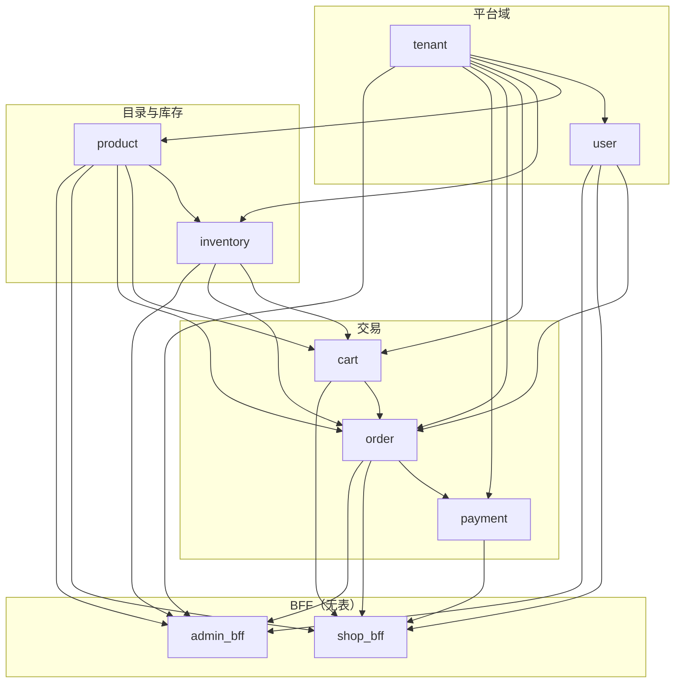
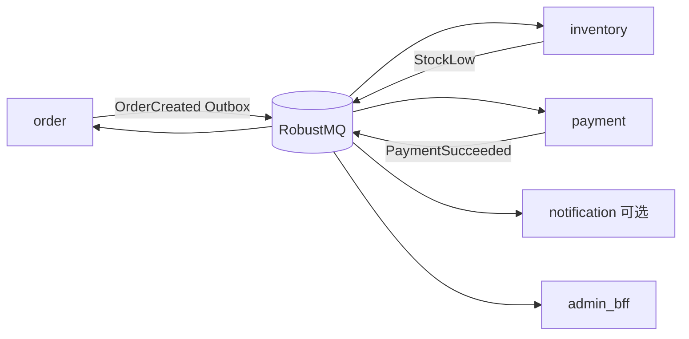

# 蓝图：多租户店（Modulith）

**定位**：按 [MODULITH.md](MODULITH.md) 骨架，给出一版可落地的**多租户电商店**模块依赖图与目录清单。  
**部署**：单二进制 + 多实例水平扩展；租户隔离用 `tenant_id`（表级）+ 中间件，不强制一租户一库。  
**对照**：平台侧可参考可运行的 `examples/tenant-mgmt/`；本蓝图在其上扩展**店面交易域**（商品 / 库存 / 购物车 / 订单 / 支付）。

---

## 1. 目标与边界

| 项 | 约定 |
|----|------|
| 产品形态 | 多租户 SaaS 店：一个进程服务 N 个店铺（`tenant_id`） |
| 入口 | `shop_bff` 店面 API；`admin_bff` 商家后台；无独立 DB 表 |
| 强一致路径 | `order` service 内调 `inventory` / `cart` / `product`（同进程） |
| 异步副作用 | Outbox → RobustMQ：`OrderCreated`、`PaymentSucceeded`、`StockLow` |
| Day-1 基础设施 | DB ConnPool、可选 Redis（会话/限流）、JWT + 限流 + recover |

**不做（第一期）**：一租户一库分片、自研 Cluster、模块间 RPC。

---

## 2. 模块依赖图

### 2.1 同步依赖（`info.dependencies`，无环）



箭头方向 = **被依赖方 → 依赖方**（A → B 表示 B 的 `dependencies` 含 A）。

### 2.2 依赖表（写入各 `module.zig`）

| 模块 | `dependencies` | 职责摘要 |
|------|----------------|----------|
| `tenant` | `{}` | 店铺/租户 CRUD、状态、套餐档位 |
| `user` | `{tenant}` | 顾客与店员；查询必带 `tenant_id` |
| `product` | `{tenant}` | SPU/SKU、上架、类目 |
| `inventory` | `{tenant, product}` | 库存增减、预留/释放 |
| `cart` | `{tenant, product, inventory}` | 购物车；校验可售与库存 |
| `order` | `{tenant, user, product, inventory, cart}` | 下单、状态机、出箱事件 |
| `payment` | `{tenant, order}` | 支付意图、回调、与订单对账 |
| `shop_bff` | `{user, product, cart, order, payment}` | 店面路由；只调 service |
| `admin_bff` | `{tenant, user, product, inventory, order}` | 商家后台路由 |

可选二期（先不进 `build` 列表）：`promotion`、`shipping`、`notification`（仅订阅事件）。

### 2.3 异步事件（不占 `dependencies`）



| 事件 | 发布方 | 订阅方 | 语义 |
|------|--------|--------|------|
| `order.created` | order | inventory, payment | 预留库存；创建支付意图 |
| `payment.succeeded` | payment | order | 订单 → paid |
| `payment.failed` | payment | order, inventory | 取消 / 释放预留 |
| `inventory.stock_low` | inventory | （告警 / admin） | 异步通知 |

规则：事件载荷带 `tenant_id` + 业务幂等键；消费者可重试。

### 2.4 请求链路（中间件）

```
HTTP
  → recover / requestId / rateLimit
  → TenantContext（X-Tenant-ID 或子域 → tenant_id）
  → JWT（店员 / 顾客）
  → DataPermission（可选行级）
  → shop_bff | admin_bff | 域 api
  → service（tenant_id 显式参数，禁止 thread-local 默契）
  → persistence（WHERE tenant_id = ?）
```

---

## 3. 目录清单

```
tenant-shop/
├── build.zig
├── build.zig.zon
├── .env.example
├── init.sql                          # 全量 schema（含 tenant_id）
├── README.md
└── src/
    ├── main.zig                      # 组装：io、池、模块、路由、run()
    ├── config.zig                    # 环境变量
    ├── foundation/
    │   ├── db.zig                    # data.Client + ConnPool
    │   ├── redis.zig                 # 可选
    │   ├── mq.zig                    # RobustMQ KafkaProducer
    │   └── outbox.zig                # 与 order 共用或独立
    ├── middleware/
    │   └── root.zig                  # Tenant → JWT → DataPermission
    ├── db/
    │   ├── schema.zig
    │   └── backend.zig               # SqlxBackend 包装
    ├── business/
    │   └── enums.zig                 # OrderStatus 等共享枚举（无业务逻辑）
    └── modules/
        ├── tenant/
        │   ├── module.zig
        │   ├── model.zig
        │   ├── persistence.zig
        │   ├── service.zig
        │   ├── api.zig               # /api/v1/admin/tenants（平台）
        │   ├── events.zig            # 可选
        │   └── root.zig
        ├── user/
        │   ├── module.zig            # deps: tenant
        │   ├── model.zig
        │   ├── persistence.zig
        │   ├── service.zig
        │   ├── api.zig
        │   └── root.zig
        ├── product/
        │   ├── module.zig            # deps: tenant
        │   ├── model.zig
        │   ├── persistence.zig
        │   ├── service.zig
        │   ├── api.zig
        │   └── root.zig
        ├── inventory/
        │   ├── module.zig            # deps: tenant, product
        │   ├── model.zig
        │   ├── persistence.zig
        │   ├── service.zig
        │   ├── api.zig
        │   └── root.zig
        ├── cart/
        │   ├── module.zig            # deps: tenant, product, inventory
        │   ├── model.zig
        │   ├── persistence.zig
        │   ├── service.zig
        │   ├── api.zig
        │   └── root.zig
        ├── order/
        │   ├── module.zig            # deps: tenant, user, product, inventory, cart
        │   ├── model.zig
        │   ├── persistence.zig
        │   ├── service.zig           # 下单事务 + Outbox
        │   ├── api.zig
        │   ├── events.zig
        │   └── root.zig
        ├── payment/
        │   ├── module.zig            # deps: tenant, order
        │   ├── model.zig
        │   ├── persistence.zig
        │   ├── service.zig
        │   ├── api.zig               # 回调入口
        │   ├── events.zig
        │   └── root.zig
        ├── shop_bff/
        │   ├── module.zig            # deps: user, product, cart, order, payment
        │   ├── api.zig               # 店面路由聚合（无 persistence）
        │   ├── service.zig           # 薄编排，可省略则 api 直调域 service
        │   └── root.zig
        └── admin_bff/
            ├── module.zig            # deps: tenant, user, product, inventory, order
            ├── api.zig
            ├── service.zig
            └── root.zig
```

**BFF 约定**：无 `persistence.zig` / 无自有表；禁止复制域 SQL。

---

## 4. `main` 组装顺序（示意）

```zig
var app = try zmodu.builder(allocator, io)
    .withName("tenant-shop")
    .build(.{
        tenant.Module,
        user.Module,
        product.Module,
        inventory.Module,
        cart.Module,
        order.Module,
        payment.Module,
        shop_bff.Module,
        admin_bff.Module,
    });
```

启动后：

1. `foundation.db` 打开池并注入各 persistence  
2. 注册全局中间件 + `shop_bff` / `admin_bff` / 域 `api.registerRoutes`  
3. `app.run()` 优雅关停  

---

## 5. 表与租户隔离（最小集）

| 表 | 必有列 | 说明 |
|----|--------|------|
| `tenants` | `id`, `status`, `tier` | 平台级 |
| `users` | `tenant_id`, … | 店员/顾客 |
| `products` / `skus` | `tenant_id`, … | |
| `inventory` | `tenant_id`, `sku_id`, `qty`, `reserved` | |
| `carts` / `cart_items` | `tenant_id`, `user_id` | |
| `orders` / `order_items` | `tenant_id`, `user_id`, `status` | |
| `payments` | `tenant_id`, `order_id`, `idempotency_key` | |
| `outbox` | `tenant_id`, `topic`, `payload`, `status` | |

所有租户域查询：`WHERE tenant_id = ?`；跨租户仅平台运维接口（单独鉴权）。

---

## 6. 分阶段落地

| 周 | 范围 |
|----|------|
| 1 | `tenant` + `user` + 中间件 + schema（可直接从 `tenant-mgmt` 拷） |
| 2 | `product` + `inventory` + `admin_bff` 商品/库存 |
| 3 | `cart` + `order`（同步预留库存）+ Outbox |
| 4 | `payment` + `shop_bff` + 压测 / CI smoke |

高并发 Day-1：ConnPool、下单幂等键、支付回调幂等、限流；Redis/RobustMQ 按流量再开。

---

## 7. 与现有示例关系

| 仓库路径 | 关系 |
|----------|------|
| `examples/tenant-mgmt/` | 平台三模块（tenant/user/subscription）可运行参考 |
| `examples/shopdemo/` | schema / 生成代码参考，非完整交易闭环 |
| `examples/tenant-shop/` | **本蓝图脚手架（Week 1–4 可跑）**：分层 Tx 编排 + checkout→pay→outbox 重试/DLQ→RobustMQ；见 [MODULE_LAYERS.md](MODULE_LAYERS.md) |

实现时优先复制 `tenant-mgmt` 的五文件与中间件链，再按依赖表增量加模块，避免一次性铺满空文件。
