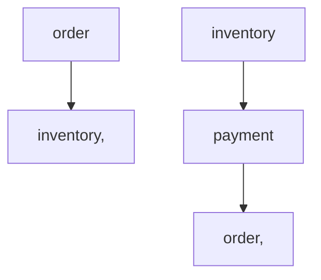

# Module Documentation

## Module Dependency Graph

## Module Details

### order

Order management

**Dependencies:** inventory 

### inventory

Inventory tracking

**Dependencies:** None

### payment

Payment processing

**Dependencies:** order 

